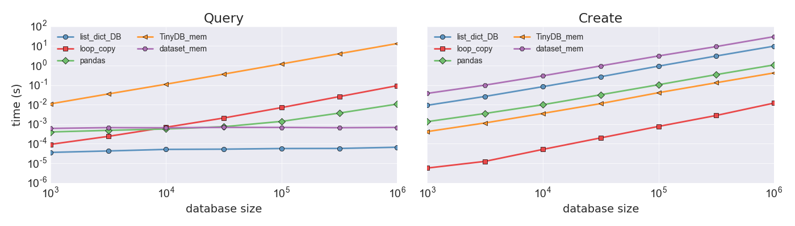

list\_dict\_DB
==============

A simple *in memory* database like object. Replace list of dictionaries
with a fast, O(1) lookup, data structure. Also supports multiple items
via a list.

It is very simple and designed for small to medium databases which can
exist purely in memory. It intended for situations where query speed is
prioritized over memory usage and instantiation time.

I built it because I was querying a list of dictionaries by multiple
keys *inside* of a loop. That cause an O(N^2) complexity and made my
moderately-sized 30,000 item list intractable!

There are other solutions out there that are more traditionally database
focused such as `TinyDB <https://tinydb.readthedocs.io/en/latest/>`__,
`buzhug <http://buzhug.sourceforge.net/>`__, etc, but this is purely
in-memory and very fast. It is likely at the cost of extra memory
overhead.

It passes all tests (with **100% test coverage**) on Python 2.7 and
Python 3.6

I am not a database expert. This simple met my needs.

Install
-------

Simply

::

    pip install list_dict_DB

Usage:
------

For more full example usage, including the flexible query methods, see
the tests.

Consider the following: (please do not argue accuracy. It is an example)

::

    items = [
        {'first':'John', 'last':'Lennon','born':1940,'role':'guitar'},
        {'first':'Paul', 'last':'McCartney','born':1942,'role':'bass'},
        {'first':'George','last':'Harrison','born':1943,'role':'guitar'},
        {'first':'Ringo','last':'Starr','born':1940,'role':'drums'},
        {'first':'George','last':'Martin','born':1926,'role':'producer'}
    ]

If we want to find all members of The Beatles who's name is "George
Harrison", we could do the following:

::

    [item for item in items if item['first']=='George' and item['last']=='Harrison']

Which is an O(N) operation. If we are only doing it once, it is fine,
but if we are doing it multiple times (especially in loops) it can cause
a major bottleneck.

Instead do:

::

    from list_dict_DB import list_dict_DB
    DB = list_dict_DB(items) # Will index them all

    DB.query(first='George',last='Harrison')

The creation is O(N) but the query is O(1) and can be done many times.

Queries
-------

There are a few different methods to perform queries. It is designed to
be flexible and allow for easy construction

Basic Queries
~~~~~~~~~~~~~

Basic queries only test equality with an ``and`` boolean relationship.

For example, to query band the example DB for band members with the
first name 'George', you can do either of the following:

::

    DB.query(first='George')
    DB.query({'first':'George'})
    DB[{'first':'George'}]      # item indecies can be queries or a number
    DB(first='George')          # Directly calling the object is a query()

To get George Harrison, you can do the following:

::

    DB.query(first='George',last='Harrison')

Or again, you can use a dictionary or mix and match. For example:

::

    DB.query({'first':'George'},last='Harrison')

Again, you are restricted to equality and AND relationships.

Advanced Queries
~~~~~~~~~~~~~~~~

Advanced queries are a bit more complex. The require a ``Qobj``. Note, a
``Qobj`` expires if the DB index changes (``update()``, ``remove()``,
``add()``, ``add_attribute()``, and ``reindex()``)

An advanced query is constructed as follows. **NOTE**: Python gets
easily messed up with assignment. Use parentheses to separate
statements!

For example, to query all elements with the first name George and the
last name **not** Martin, you can do:

::

    Q = DB.Qobj() # Instantiate it with the DB. DB.Q() will also work
    DB.query( (Q.first=='George') & (Q.last != 'Martin') )

Or

::

    DB.query( (DB.Q().first=='George') & (DB.Q().last != 'Martin') )

Notice:

-  Use of parentheses. The queries must be separated
-  We are checking equality so ``==`` and ``!=`` are used

   -  You can also negate with ``~`` but again, be careful and
      deliberate about parentheses

-  We instantiate the ``Q`` object with the DB. If the DB index is
   changed, the ``Q`` object will not be allowed to run as a precaution.
-  We used ``&`` for ``and`` and ``|`` for ``or``
-  ``<``, ``<=``, ``>``, ``>=``, and filters are supported but these are
   O(N) opperations.

You can also do more advanced boolean logic such as:

::

    DB.query( ~( (Q.role=='guitar') | (Q.role=='drums')))

Filters
^^^^^^^

A filter allows for more advanced queries of the data but, as noted
below, are O(N) (as with ``<``, ``<=``, ``>``, ``>=``).

For example, to perform a simple equality, the following return the same
entry. But do note that the equality version is *much faster*.

Edge Case: If an attribute's name is 'filter', the filter method may be
accessed through ``_filter``.

::

    # Traditional lookup:
    DB.query(Q.first == 'George') # equality is O(1)

    # Filter lookup
    filt = lambda item: True if item['first'] == 'George' else False
    DB.query(Q.filter(filt))

The are flexible for more advanced queries

WARNING about speed
^^^^^^^^^^^^^^^^^^^

Some of the major speed gains in this are due to the use of dictionaries
and sets which are O(1) complexity.

Queries with ``<``, ``<=``, ``>``, ``>=``, and ``filters`` are O(N)
opperations and should be avoided if possible.

The time complexity of a query will depend on the number of items that
match any part of the query.

Loading and Saving (Dumping)
----------------------------

There is *intentionally* no built in way to dump these as they are
intended to be *in-memory*. Of course, the a good way to save or load is
as follows:

Dump:

::

    import json
    with open('DB.json','w') as F:
        json.dump(DB.items(),F)

Load:

::

    from list_dict_DB import list_dict_DB
    import json
    with open('DB.json') as F:
        DB = list_dict_DB(json.load(F))

Lists:
------

All attributes must be hashable. The only exception are lists in which
case the list is expanded for each item. For example, an entry may be:

::

    {'first':'George','last':'Harrison','born':1943,'role':['guitar','sitar']}

and

::

    DB.query(role='sitar')

will return him.

Benchmarks & Complexity Testing
-------------------------------

I compared the creating and querying a large database with the following
methods. Note that some cache results so I recreated and re-queried from
scratch. In practice, even caching the results does not help much if the
queries change.

-  ``list_dict_DB``
-  simple looping with a *copied* list (*not* ``deepcopy`` though)
-  `Pandas <http://pandas.pydata.org/>`__ dataframe (0.16.2)
-  `TinyDB <https://tinydb.readthedocs.io/en/latest/>`__ (3.2.2) with
   in-memory storage
-  `dataset <https://dataset.readthedocs.io/en/latest/>`__ (0.6.0) with
   slite3 in-memory storage

   -  dataset is a wrapper to
      `SQLAlchemy <http://www.sqlalchemy.org/>`__ that (in my words)
      provides a noSQL interface to SQL.

I tested on my MacBook Pro (Retina, 15-inch, Mid 2014) laptop with 2.8
GHz i7 and 16 gb of ram using Python 2.7.9.

The following figure is the time to build and query the resulting data
object. Note that for TinyDB, the object was deleted between tests since
it caches queries

|benchmarks|

From the slope of the plots, you can estimate the complexity. I just
calculated from the final point. The order is O(N^{slope})

+--------------------+---------------+----------------+
| Tool               | Query slope   | Create slope   |
+====================+===============+================+
| ``list_dict_DB``   | 0.12          | 1.01           |
+--------------------+---------------+----------------+
| ``loop_copy``      | 1.12          | 1.27           |
+--------------------+---------------+----------------+
| ``pandas``         | 0.92          | 0.99           |
+--------------------+---------------+----------------+
| ``TinyDB_mem``     | 1.04          | 1.00           |
+--------------------+---------------+----------------+
| ``dataset_mem``    | 0.03          | 1.02           |
+--------------------+---------------+----------------+

`dataset <https://dataset.readthedocs.io/en/latest/>`__ gives this tool
a run for its money but it also has a lot more dependancies and was the
slowest in creation time (though, if you use it with a file, once it is
created, you do not have to recreate it again). Pandas also performs
well and only starts to have the O(N) dependency creep in at larger
sizes. Of course, this is a scaling analysis. When you look at actual
query times, ``list_dict_DB`` is orders of magnitude faster!

Which tool is the best will be problem dependent, but these results make
a strong argument for ``list_dict_DB``

Known Issues
------------

None at the moment.

There is 100% (!!!) test coverage. Of course that doesn't mean there
aren't bugs. If you find any, please report them.

Limitations
-----------

-  The entire DB exists in memory
-  Serializing (dumping) is not included though is easy to do with JSON
   or the like. See above
-  The index used in the dictionary is itself a dictionary with keys as
   any value. Since these are all done as pointers to original list, the
   memory footprint should be small.
-  This has **not** been tested for thread-safety!

